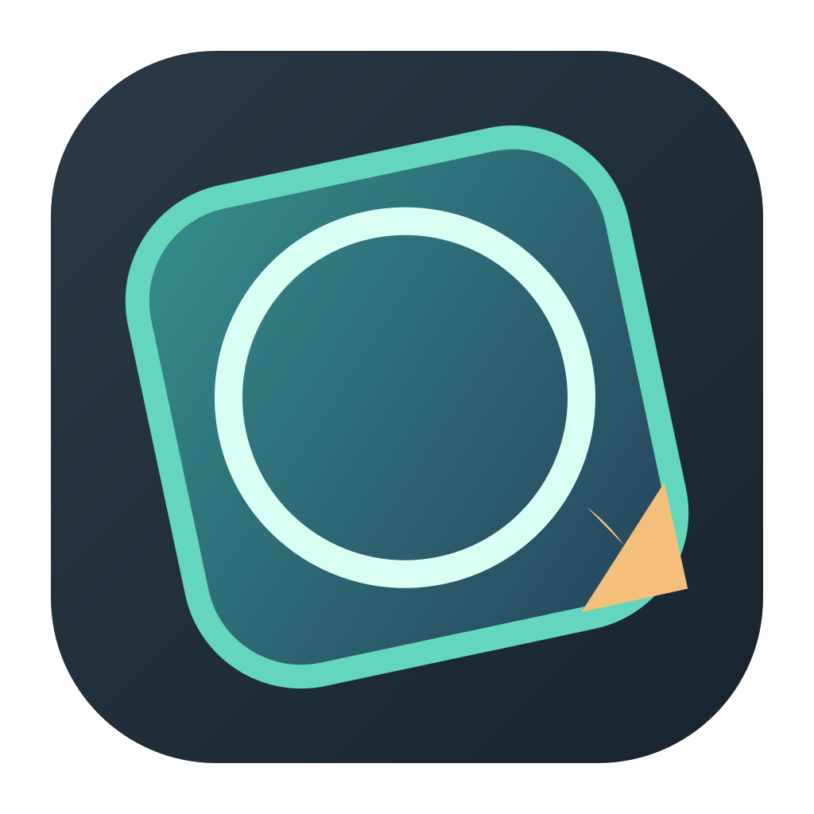
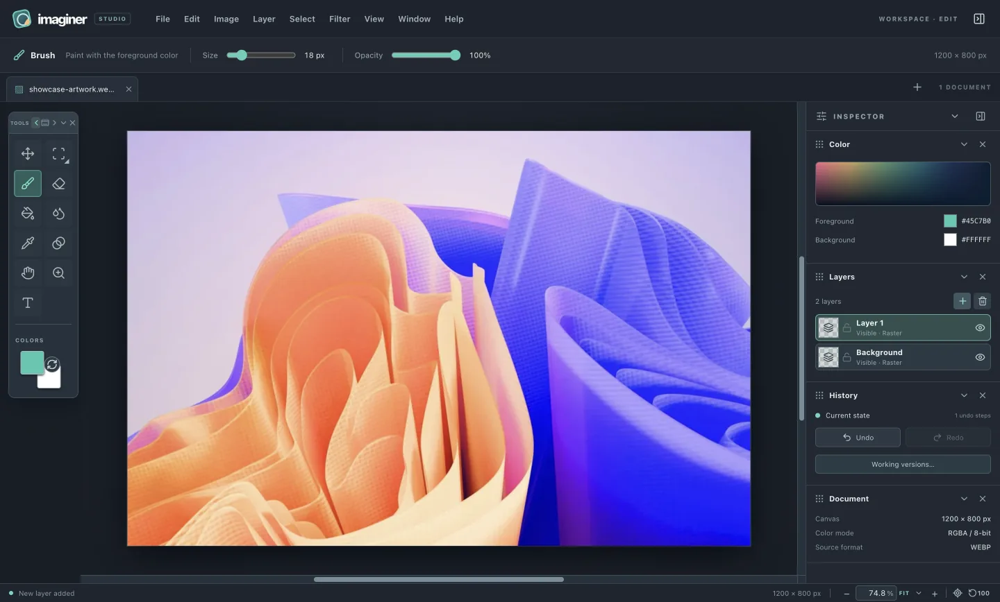

<p align="center">
  
</p>

# Imaginer Studio

A desktop image editor for macOS, with layers, editable text and shapes, painting, retouching and transforms.

**Closed-source app. Built installers only.** Imaginer's application project source is private and is not published or offered for download.

**Latest release: [0.3.13](https://github.com/protagorai/Imaginer-releases/releases/tag/v0.3.13)** · 5 October 2026 · Apple silicon development build.

[Download the latest DMG](https://github.com/protagorai/Imaginer-releases/releases/latest/download/Imaginer-latest-mac-arm64.dmg) · [What's new, updated and fixed](release-notes/v0.3.13.md) · [Product website](https://imaginer.site/) · [All releases](https://github.com/protagorai/Imaginer-releases/releases)



Actual Imaginer editor; artwork by [Tridimensi Pro / Unsplash](https://unsplash.com/photos/abstract-colorful-waves-in-shades-of-orange-and-blue-2qWf0dZzPlw).

## What's new in 0.3.13

- **Added:** layer blending and effects, clipping masks, editable vector shapes, transforms, Crop, Clone Stamp, retouch tools, Pencil and configurable shortcuts.
- **Updated:** paired sliders and exact fields, independent paint settings, responsive stroke previews, guide positioning and explicit flattened PSD previews.
- **Fixed:** selection dismissal, layer-thumbnail alpha selections, guide removal at edges and legacy PSD lock/resolution handling.
- Changed documents offer **Save**, **Don't Save** and **Cancel** when closing tabs or the app.

Read the [full 0.3.13 release notes](release-notes/v0.3.13.md) for compatibility, limits and installation details. Notes are also included on each [GitHub release page](https://github.com/protagorai/Imaginer-releases/releases/tag/v0.3.13).

## Download and install

| Release detail | Value |
| --- | --- |
| Latest published version | 0.3.13 |
| Platform | macOS 13 or later / Apple silicon (arm64) |
| DMG size | 142,041,593 bytes (142.0 MB; 135.5 MiB) |
| Signing | Ad hoc; not Developer ID signed or notarized |

[Download the exact 0.3.13 installer](https://github.com/protagorai/Imaginer-releases/releases/download/v0.3.13/Imaginer-latest-mac-arm64.dmg). The Latest download above follows future releases; each version's release notes record its own checksum.

SHA-256 for **0.3.13**:

```text
2452ae6760a86835ccd07bf1d9a5370e1b92528a7f3b71d67bc85eecb385d92b
```

1. Compare the downloaded file with this version's checksum: `shasum -a 256 Imaginer-latest-mac-arm64.dmg`.
2. Open the DMG and drag **Imaginer** into **Applications**.
3. If macOS blocks this development build, follow [Apple's guidance for opening an app from an unknown developer](https://support.apple.com/guide/mac-help/open-a-mac-app-from-an-unknown-developer-mh40616/mac) after checking the file.

## About GitHub's “Source code” links

GitHub automatically adds **Source code (zip)** and **Source code (tar.gz)** links to releases. They archive this public repository's documentation, not the Imaginer application project. The `v0.3.13` archives contain only `README.md` and `.gitignore`. Download the **DMG** to install Imaginer.

This repository hosts the built installer as a **GitHub Release asset**. Its Git tree and history contain only the README, product images, release notes and ignore rules. The application and website source repositories are private; application project source archives, development files and source maps are not distributed here.
